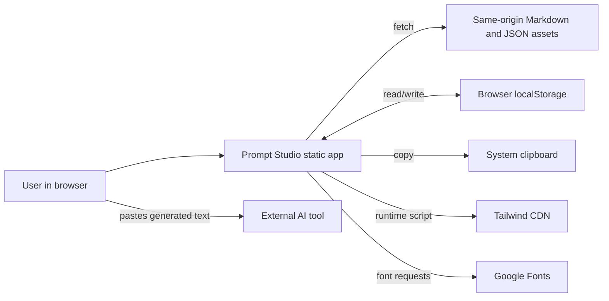
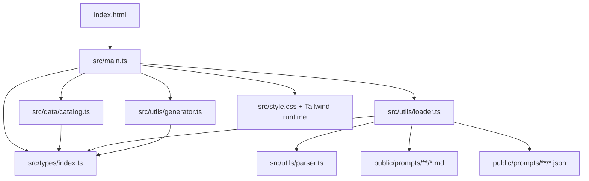
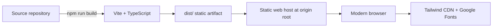

# Architecture

Status: **Observed architecture**  
Last verified: **2026-09-19**

## Architectural style

Prompt Studio is a static, client-only single-page application built with vanilla TypeScript and direct DOM manipulation. It has two compile-time parts and one runtime asset set:

- Vite compiles and bundles the TypeScript/CSS application shell.
- `src/data/catalog.ts` statically registers categories and template asset paths.
- `public/prompts/` is copied as static assets and fetched on demand in the browser.

There is no backend, database, application API, authentication boundary, server-side rendering, worker, queue, or application-managed infrastructure.

## System context

The external AI tool is a user-controlled downstream destination; Prompt Studio does not call it.

## Component model

## Components and responsibilities

| Component | Responsibility |
| --- | --- |
| `index.html` | HTML shell, Tailwind CDN bootstrapping, Tailwind theme extension, application mount point. |
| `src/main.ts` | Application state, DOM construction, rendering, event handling, persistence, and workflow coordination. |
| `src/data/catalog.ts` | Category and template registry; maps IDs to public asset paths. |
| `src/types/index.ts` | Shared catalog, schema, state, and generation contracts. |
| `src/utils/loader.ts` | Concurrent fetch, response checking, JSON parse, schema consistency validation, in-memory cache. |
| `src/utils/parser.ts` | Placeholder extraction and key-set comparison. |
| `src/utils/generator.ts` | Required validation, optional-line removal, substitution, cleanup, language suffix. |
| `src/style.css` | Custom surfaces, controls, dark styles, animation, reduced-motion behavior. |
| `public/prompts/` | Runtime prompt content and form metadata. |

## Runtime sequence

1. Browser loads `index.html`, external Tailwind script, main ES module, and CSS/font resources.
2. `main.ts` reads `prompt-studio-state-v1` and chooses valid catalog defaults.
3. Static shell and empty/loading states render.
4. Selected template Markdown and JSON schema are fetched concurrently.
5. Loader validates placeholder/schema key parity and caches the pair by template ID.
6. UI renders fields and accepts user input, persisting changes to `localStorage`.
7. Generator creates output synchronously in memory.
8. Preview uses `textContent`; clipboard transfer occurs only on user action.

See [18-data-flow.md](18-data-flow.md) for detailed flow diagrams.

## State model

- A single mutable `state` object in `src/main.ts` is the runtime state store.
- UI is updated through explicit render functions rather than a reactive framework.
- Category/template/language/theme/inputs are persisted separately as `StoredState`.
- Loaded assets use a page-lifetime `Map<string, LoadedTemplate>`.
- Generated output is transient and exists only in runtime state.

## Runtime and deployment architecture

The repository does not identify a hosting provider, environment topology, CI pipeline, or release process.

## Security boundaries

- All application logic and prompt generation execute in the browser.
- Same-origin static content is trusted code/content configuration.
- Browser `localStorage` is the persistence boundary and is readable by any script running on the same origin.
- Tailwind and Google Fonts are third-party runtime trust/network boundaries.
- The system clipboard is accessed through browser APIs after user interaction.

## Scalability and reliability characteristics

- Static files can be distributed by a typical CDN, but no such setup is committed.
- No server compute or shared state must scale.
- Catalog size increases initial JavaScript catalog data and template-picker DOM; content is otherwise loaded on demand.
- The in-memory cache avoids repeat asset fetches within a page session.
- There is no offline cache; first use and uncached templates require network availability.
- Third-party CDN failure affects styling/fonts even if first-party assets remain available.

## Why it appears structured this way

- **INFERRED:** Separating Markdown, schema, and catalog keeps prompt wording editable while preserving typed UI metadata.
- **INFERRED:** A client-only architecture fits a tool that performs deterministic text substitution and needs no shared data.
- **UNKNOWN:** Historical rationale for avoiding a framework, using runtime Tailwind, or choosing `localStorage` is not recorded.

## Known architectural concerns

- `src/main.ts` owns nearly all UI markup, state, rendering, and events; further feature growth would increase coupling and review surface.
- Template cache keys use template ID alone. IDs are unique today, but a future duplicate ID in another category would collide.
- Absolute `/prompts/...` paths assume root hosting and do not automatically honor a non-root Vite base path.
- Tailwind is generated in the browser from a CDN script rather than included in the Vite build.
- The header's `13 templates` label is hard-coded separately from the catalog.
- Stored state and JSON schema data are cast to TypeScript types without runtime structural validation.
- Template/configuration strings are sometimes inserted with `innerHTML`; current assets are trusted, but the design is not safe for arbitrary untrusted template metadata.
