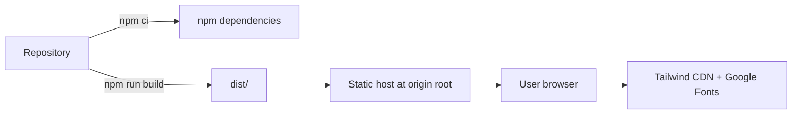

# Build and deployment

Status: **Verified build behavior; hosting process unknown**  
Last verified: **2026-09-19**

## Environments present in the repository

| Environment | Current support |
| --- | --- |
| Local development | Vite dev server via `npm run dev`. |
| Local production preview | Vite preview server via `npm run preview` after build. |
| Development/staging/production hosting | **UNKNOWN.** No provider or environment configuration exists. |

## Prerequisites

- Node.js compatible with Vite 7. The root README records Node.js 20.19+ or 22.12+.
- npm and network access for initial dependency installation.
- Network access at runtime for Tailwind CDN and Google Fonts if the intended appearance is required.

## Build

```bash
npm ci
npm run build
```

`npm run build` executes:

1. `tsc -p tsconfig.app.json --noEmit`
2. `vite build`

Output is written to `dist/`. Vite copies all files under `public/`, including 13 `.md` templates and 13 `.json` schemas, into `dist/prompts/`.

## Hosting requirements

- Serve `dist/` as static files.
- Serve `index.html` for `/`.
- Serve `/assets/*` and `/prompts/*` with correct MIME types.
- Preserve `.md` and `.json` filenames and case.
- Use HTTPS in production for transport integrity and best Clipboard API support.
- Permit outbound browser access to Tailwind CDN and Google Fonts, or accept degraded/failed styling.

The app does not implement client-side routes, so history-API fallback is not required for known behavior.

## Root-path constraint

Catalog asset URLs are absolute, such as `/prompts/coding/debug.md`. The repository has no `vite.config.*` base setting. Deploying below a path such as `https://example.com/tools/prompt-studio/` will cause prompt requests to target the origin root unless code/configuration is changed.

## Deployment diagram



## Configuration and secrets

- There are no environment variables.
- There are no application secrets.
- Environment-specific deployment settings are not present.
- Security headers, caching headers, compression, redirects, and CDN behavior must be defined by the chosen host.

## CI/CD, rollback, and migrations

- CI/CD: **Not configured**.
- Deployment automation: **Not configured**.
- Rollback: **Provider-specific and unknown**; retain a prior static artifact if rollback is required.
- Database migration: **Not applicable**.
- Health check: **Not implemented**; static-host availability and representative asset checks would be external concerns.

## Post-deployment verification

1. Load `/` with an empty cache.
2. Confirm external styles/fonts load or expected fallbacks render.
3. Request a representative `.md` and `.json` asset directly.
4. Generate and copy a prompt.
5. Confirm reload persistence.
6. Check console/network errors and both light/dark modes.
7. Verify `404` behavior for a deliberately invalid prompt path is not rewritten to HTML.
