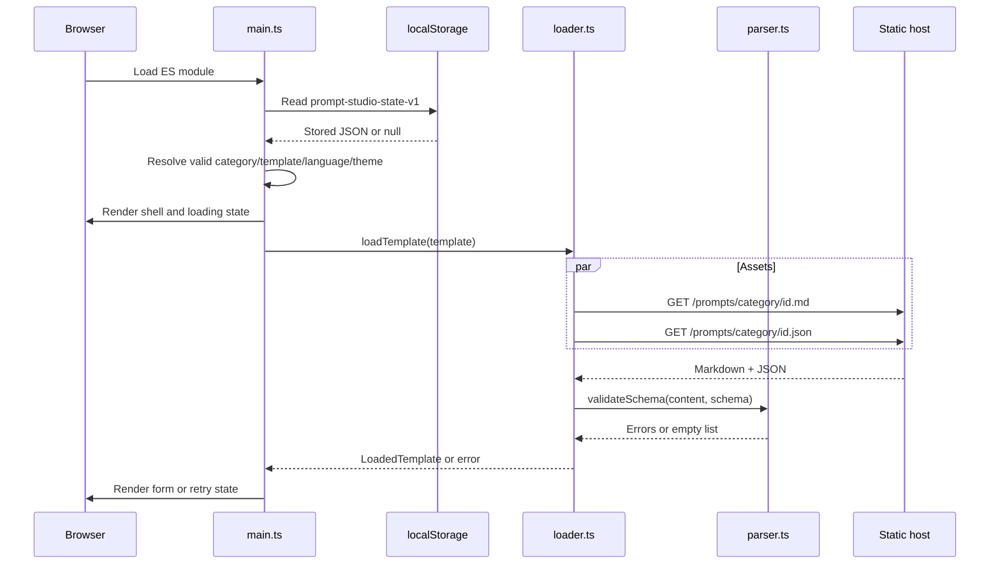
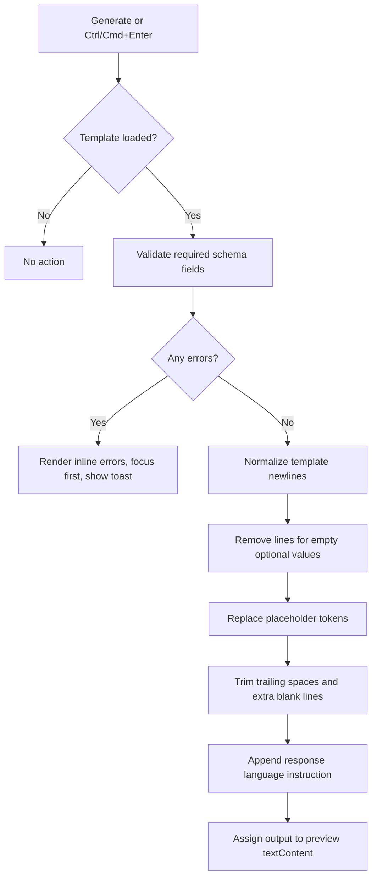

# Data flow

Status: **Current**  
Last verified: **2026-09-19**

## Data classifications

| Data | Origin | Storage | Leaves browser through app logic? |
| --- | --- | --- | --- |
| Catalog metadata | `src/data/catalog.ts` bundle | Memory | No |
| Prompt content | Same-origin `.md` assets | Memory cache | Fetched into browser only |
| Field schema | Same-origin `.json` assets | Memory cache | Fetched into browser only |
| User field values | User | Runtime state + `localStorage` | No application submission path |
| Selected language/theme/IDs | User/defaults | Runtime state + `localStorage` | No |
| Generated prompt | Generator | Runtime state/DOM | Clipboard on user action |
| Search query/errors | User/application | Runtime state/DOM | No |

## Startup and template loading



Successfully loaded assets are cached in a page-lifetime map keyed by template ID.

## Input and persistence

For every input event:

```text
Form control
→ state.inputs[currentTemplateId][fieldName]
→ clear that field's active error when nonblank
→ recompute required-field readiness
→ JSON.stringify(StoredState)
→ localStorage['prompt-studio-state-v1']
```

Storage writes are synchronous and happen on every input event. There is no debounce, quota handling, encryption, server synchronization, or migration.

## Prompt generation



Generation is synchronous, deterministic text transformation. It does not call a server or AI model.

## Clipboard flow

```text
User selects Copy
→ navigator.clipboard.writeText(output)
→ success toast

On rejection:
→ hidden textarea
→ document.execCommand('copy')
→ success or failure toast
```

## State invalidation

| Event | Output | Errors | Inputs | Search |
| --- | --- | --- | --- | --- |
| Select template | Cleared | Cleared | Preserved per template | Preserved |
| Select category | Cleared through template selection | Cleared | Preserved | Cleared |
| Change language | Cleared | Unchanged | Preserved | Preserved |
| Reset | Cleared | Cleared | Current template cleared | Preserved |
| Reload | Not restored | Not restored | Restored | Not restored |

## External resource data flow

The browser independently requests Tailwind JavaScript and Google Fonts. These requests expose standard HTTP metadata to those providers. The application does not intentionally include prompt field values in those requests.
